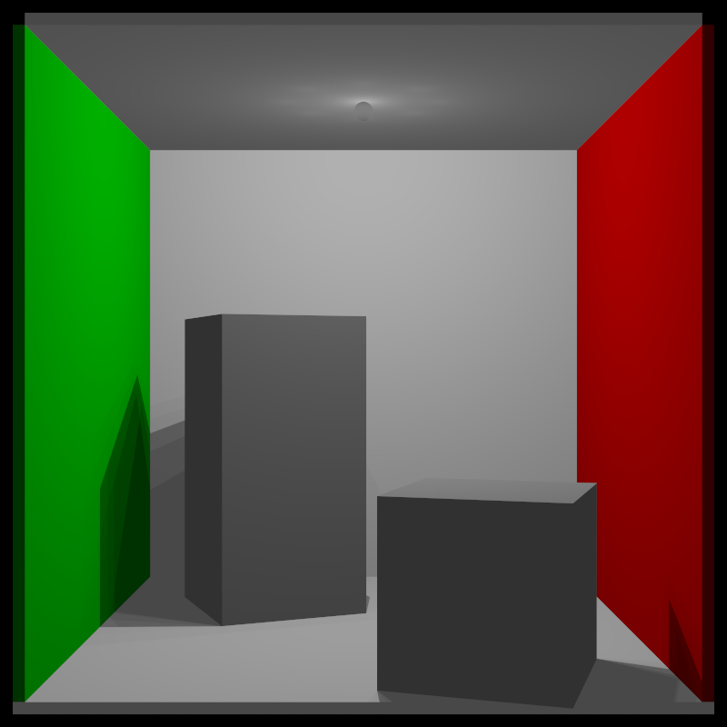

# Raytracer 3D

Este é um raytracer desenvolvido em C++ para renderizar cenas 3D com iluminação usando o modelo Phong.

## Cornell Box de Referência

A imagem de referência da Cornell Box que este projeto produz:



## Funcionalidades

- Renderização de cenas 3D com o algoritmo de ray tracing
- Formas geométricas: Esferas e Caixas
- Iluminação direta com modelo Phong
- Sombras
- Anti-aliasing com múltiplas amostras por pixel
- Transformações de modelagem: translação e rotação
- Iluminação suave simulada com múltiplas luzes pontuais

## Estrutura do Projeto

```
raytracer/
├── include/              # Arquivos de cabeçalho
│   ├── core/             # Componentes principais
│   ├── geometry/         # Formas geométricas
│   ├── light/            # Fontes de luz
│   ├── material/         # Materiais
│   └── transform/        # Transformações
├── examples/             # Exemplos de cenas
│   └── enhanced_scene.cpp # Cornell Box de referência
├── scripts/              # Scripts de utilidade
│   └── run_cornell_box.sh # Script para gerar a Cornell Box
├── output/               # Imagens renderizadas
├── CMakeLists.txt        # Configuração do CMake
└── README.md             # Este arquivo
```

## Como Reproduzir a Cornell Box

### Usando o Script

A maneira mais simples de gerar a Cornell Box é usando o script fornecido:

```bash
# No diretório raiz do projeto
chmod +x scripts/run_cornell_box.sh
./scripts/run_cornell_box.sh
```

Este script irá:
1. Compilar o código-fonte
2. Executar o raytracer para gerar a imagem
3. Salvar o resultado no formato PPM em `output/cornell_box_reference.ppm`
4. Converter para PNG (se o ImageMagick estiver instalado) e abrir a imagem

⚠️ **Atenção**: A renderização pode levar vários minutos devido ao alto número de amostras por pixel (1000).

### Compilação Manual

Se preferir compilar manualmente:

```bash
# No diretório raiz do projeto
mkdir -p build
cd build
g++ -std=c++11 -O3 -I.. ../examples/enhanced_scene.cpp -o cornell_box
./cornell_box
```

### Visualização da Imagem

A imagem é gerada no formato PPM. Você pode convertê-la para PNG usando:

```bash
# Se tiver ImageMagick instalado
convert output/cornell_box_reference.ppm output/cornell_box_reference.png
```

## Requisitos

- Compilador C++11 ou superior
- ImageMagick (opcional, para converter PPM para PNG)

## Parâmetros de Renderização

A imagem de referência é renderizada com os seguintes parâmetros:
- Resolução: 800x800 pixels
- Amostras por pixel: 1000 (anti-aliasing)
- Profundidade máxima de reflexão: 5

Você pode ajustar esses parâmetros no arquivo `examples/enhanced_scene.cpp`. 